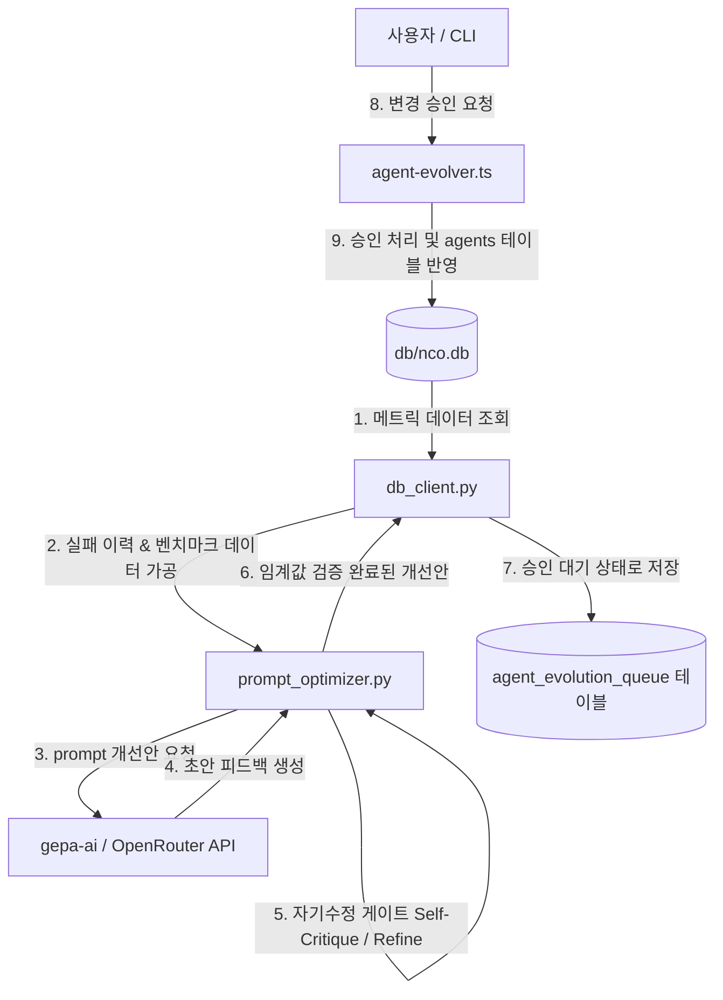

# NCO Autonomy Workstream 4 (WS4) — GEPA Sidecar Pilot Design

본 문서는 NCO 자율성 축 워크스트림 4(WS4)인 **GEPA 사이드카 파일럿(GEPA Sidecar Pilot)**의 단독 설계안을 기술합니다. 이 사이드카는 주기적으로 DB 상의 에이전트 호출 데이터, verifier 결과, 그리고 benchmark 결과를 분석하여 openrouter 에이전트의 persona.systemPrompt에 대한 자가 개선 제안을 생성하고, 이를 자기수정 승인 게이트를 거쳐 승인 큐에 등록하는 Python 기반의 독립 프로세스입니다.

---

## 1. 파일 구조 (File Structure)

사이드카는 `sidecar/gepa/` 디렉터리 하위에 Python 모듈로 설계되며, 기존 TypeScript 메인 코드베이스와 데이터베이스 및 API 수준에서 긴밀히 통합됩니다.

```
/Users/nova-ai/project/nco/
├── docs/
│   └── autonomy-ws4-gepa-sidecar.md       # 본 설계 문서
├── sidecar/
│   └── gepa/
│       ├── __init__.py
│       ├── config.py                      # DB 경로, OpenRouter API 키, 모델/임계값 설정
│       ├── db_client.py                   # SQLite DB 쿼리 및 승인 큐 삽입 모듈
│       ├── prompt_optimizer.py            # GEPA AI를 활용한 Prompt 개선 및 Self-Critique 수행
│       ├── scheduler.py                   # 주기적 배치 실행 관리자 (APScheduler 기반)
│       └── requirements.txt               # 의존성 정의 (sqlite3, openai, apscheduler 등)
└── src/
    └── core/
        └── agent-evolver.ts               # (TS 확장) 승인된 프롬프트 최종 반영 및 로그 관리
```

---

## 2. 데이터 흐름 (Data Flow)

GEPA 사이드카는 메인 시스템과 독립된 데몬 또는 주기적 크론 작업으로 기동하며, 다음과 같은 파이프라인으로 동작합니다.



1. **메트릭 수집 (Metric Collection)**:
   * `db_client`가 SQLite DB에서 `openrouter` 에이전트의 최근 실행 통계(`agent_invocations`), 검증 결과(`verification_gates`), 최신 벤치마크 스코어(`benchmark_results`)를 조회합니다.
2. **개선안 도출 (GEPA Optimization)**:
   * 수집된 에러 로그 및 실패 사유를 컨텍스트로 묶어 `gepa-ai/gepa` 프롬프트 튜닝 최적화 엔진(OpenRouter를 통해 구동하는 meta-prompt)에 전달합니다.
   * `gepa-ai`는 해당 에러 유형을 회피하고 성능을 올릴 수 있는 `persona.systemPrompt` 개선 초안을 도출합니다.
3. **자기수정 승인 게이트 (Self-Correction Approval Gate)**:
   * 생성된 개선안은 즉시 승인 큐로 가지 않고, 사이드카 내부의 **자가 평가(Self-Critique & Refine)** 단계를 거칩니다.
   * 프롬프트 개선안이 원래 프롬프트의 제약사항(Core Operating Principles)을 훼손하지 않는지, 그리고 수집된 에러 유형들을 예방할 수 있는지 검증하여 0.0 ~ 1.0 점수를 매깁니다.
   * 점수가 임계값(e.g., 0.8) 이상인 경우에만 승인 큐에 등록하며, 실패 시 최대 2회까지 재교정(Refinement)을 시도합니다.
4. **승인 큐 등록 (Queueing)**:
   * 통과된 제안서는 `agent_evolution_queue` 테이블에 `pending_approval` 상태로 기록됩니다. **(자동 반영 절대 금지)**
5. **승인 및 반영 (Approve & Evolve)**:
   * 사용자 또는 시스템 운영자가 TS API Endpoint(또는 CLI Command)를 통해 변경안을 최종 승인하면, TS 레이어의 `agentEvolver`를 거쳐 `agents` 테이블의 `persona_json`에 최종 주입됩니다.

---

## 3. API 및 데이터베이스 스키마 (API & Schema)

### A. SQLite 신규 테이블 스키마 (`agent_evolution_queue`)
승인 대기 중인 프롬프트 개선안을 임시 적재하고 상태를 관리하기 위해 `db/nco.db` 내에 신규 테이블을 정의합니다.

```sql
CREATE TABLE IF NOT EXISTS agent_evolution_queue (
    id INTEGER PRIMARY KEY AUTOINCREMENT,
    agent_id TEXT NOT NULL,
    old_prompt TEXT NOT NULL,
    new_prompt TEXT NOT NULL,
    rationale TEXT NOT NULL,                -- 개선 사유 (어떤 실패를 개선하고자 하는가)
    critique_score REAL NOT NULL,           -- 자기수정 게이트에서 산출한 평가 점수 (0.0~1.0)
    critique_text TEXT NOT NULL,            -- 자기수정 게이트의 평가 근거 및 코멘트
    status TEXT NOT NULL DEFAULT 'pending_approval', -- 'pending_approval' | 'approved' | 'rejected' | 'applied'
    created_at TEXT NOT NULL DEFAULT (datetime('now')),
    reviewed_at TEXT,
    FOREIGN KEY(agent_id) REFERENCES agents(id)
);
CREATE INDEX IF NOT EXISTS idx_evo_queue_agent ON agent_evolution_queue(agent_id, status);
```

### B. TypeScript API 인터페이스 및 엔드포인트
기존 `src/core/agent-evolver.ts`를 확장하여 다음 메서드와 인터페이스를 노출합니다.

```typescript
export interface EvolutionProposal {
  id: number;
  agentId: string;
  oldPrompt: string;
  newPrompt: string;
  rationale: string;
  critiqueScore: number;
  critiqueText: string;
  status: 'pending_approval' | 'approved' | 'rejected' | 'applied';
  createdAt: string;
}

// class AgentEvolver 내 추가될 핵심 퍼블릭 메서드
class AgentEvolver {
  // 1. 대기 중인 개선 제안 목록 조회
  async getPendingProposals(agentId?: string): Promise<EvolutionProposal[]>;
  
  // 2. 개선 제안 승인 및 적용 (agents Table 및 agent_evolution_log 반영)
  async approveProposal(proposalId: number): Promise<boolean>;
  
  // 3. 개선 제안 반려
  async rejectProposal(proposalId: number): Promise<boolean>;
}
```

* **신규 HTTP 라우트 (Gateway 연동)**
  * `GET /api/evolver/queue` : 승인 대기 중인 프롬프트 후보군 목록 반환
  * `POST /api/evolver/approve/:id` : 승인 요청 처리 (해당 프롬프트를 `agents` 테이블에 업데이트하고 상태를 `applied`로 변경)
  * `POST /api/evolver/reject/:id` : 반려 처리 (상태를 `rejected`로 업데이트)

---

## 4. 연결 및 통합 지점 (Connection Points)

1. **데이터베이스 공유 (`db/nco.db`)**:
   * Python 사이드카는 SQLite 드라이버를 사용하여 DB에 읽기/쓰기를 수행합니다.
   * 수집 대상 테이블: `agent_invocations`, `verification_gates`, `benchmark_results`, `agents`
   * 기록 대상 테이블: `agent_evolution_queue`
2. **Agent-Evolver TS 게이트웨이**:
   * 사이드카가 생성한 제안 데이터는 독립된 CLI 또는 Web Dashboard의 승인 인터페이스를 통해 최종 통제됩니다.
   * 승인이 활성화되면, TS 메인 백엔드는 `agentEvolver` 인스턴스를 통해 대상 에이전트의 `persona_json` 프로퍼티를 동적으로 안전하게 교체하고 기록(`agent_evolution_log`)을 남깁니다.
3. **외부 API (OpenRouter/GEPA AI)**:
   * Python 사이드카 내 `prompt_optimizer.py`는 `https://openrouter.ai/api/v1`을 대상으로 REST API 통신을 수행하여 최적화 및 평가 LLM 프롬프트를 처리합니다.

---

## 5. 자기수정 승인 게이트 (Self-Correction Gate)

자동 생성된 프롬프트가 프로덕션에 영향을 미치기 전에 논리적/성능 검증을 보장하기 위한 사이드카 내부 검증 레이어입니다.

```python
# prompt_optimizer.py 내 자기수정 수도코드 로직 개요
class SelfCorrectionGate:
    def evaluate_proposal(self, original_prompt, proposed_prompt, error_logs) -> dict:
        """
        1. proposed_prompt가 기존 Core Principle(VERIFY BEFORE CLAIM 등)을 보존하는가?
        2. 수집된 에러(error_logs)를 피하기 위한 프롬프트 가이드라인이 명시되어 있는가?
        3. 변경 사항이 시스템 운영 원칙을 훼손하지 않는가?
        """
        # GEPA / LLM 평가기 호출을 통해 critique_text 및 0.0~1.0 사이의 점수 산출
        result = call_evaluator_llm(original_prompt, proposed_prompt, error_logs)
        return {
            "score": result.score,      # 예: 0.85
            "critique": result.feedback # 예: "에러 패턴 예방 가이드 추가됨. 원칙 보존됨."
        }
```
* **동작 규칙**:
  * `critique_score >= 0.8`: 승인 큐(`agent_evolution_queue`)에 `pending_approval` 상태로 적재.
  * `critique_score < 0.8`: `critique` 분석 피드백을 반영하여 프롬프트 재작성 요청 (최대 2회).
  * 최종 실패 시, 오류 리포트 로그를 남기고 승인 큐 등록을 취소하여 오염된 프롬프트가 주입되는 것을 원천 차단합니다.

---

## 6. 리스크 및 완화 방안 (Risks & Mitigations)

| 리스크 유형 | 구체적 영향 | 완화 방안 |
| :--- | :--- | :--- |
| **프롬프트 역행 (LLM Drift / Regression)** | 특정 실패 케이스를 교정하다 일반 성능이 저하됨 | `agent_evolution_queue` 스키마에 `rationale`을 필수 수집하고, 승인 화면에서 구체적 실패 내역과 비교 대조할 수 있도록 사용자 편의 제공. |
| **무한 자가 평가 루프 (Agreement Loop)** | 자기수정 LLM이 부적절한 프롬프트를 계속 합격시킴 | 자가 평가기에 "Strict Checklist Rules"를 Meta-Prompt로 주입하고, 시도 횟수를 최대 2회로 엄격하게 캡핑(Capping). |
| **DB 동시성 충돌 (SQLite Locking)** | 파이썬 사이드카의 주기적 쓰기와 메인 TS API 쓰기가 겹쳐 잠금 발생 | Python sqlite3 접속 시 WAL(Write-Ahead Logging) 모드를 명시적으로 활성화하고, 트랜잭션 타임아웃을 10초로 지정하여 안전성 보장. |
| **프롬프트 주입 (Prompt Injection)** | 에러 로그에 포함된 악성 유저 텍스트가 시스템 프롬프트에 침투함 | LLM에 전달하기 전 에러 내용 내 유저 입력 영역(stdin, user_prompt)을 감지하고 정규식이나 길이 제한으로 필터링 처리. |

---

## 7. 검증 계획 및 증거 수준 (Verification Plan)

*(본 설계는 구현 이전 상태이며 **unverified** 등급입니다)*

* **1단계 증거 (최상위: 파일/DB 실측)**:
  * Python 사이드카 실행 후 SQLite `agent_evolution_queue` 테이블에 새로운 튜닝 레코드가 올바르게 쌓이는지 SELECT 쿼리 결과로 직접 확인합니다.
  * TS 엔드포인트 `/api/evolver/approve/:id` 호출 이후 `agents` 테이블의 `persona_json` 값이 수정되었는지 실제 SQL 스냅샷으로 대조 검증합니다.
* **2단계 증거 (프로세스 기동 및 로그)**:
  * Python 스크립트 실행 과정 중 발생하는 자가 수정 게이트 점수(`critique_score`) 산출 로그를 standard output으로 모니터링합니다.
* **3단계 증거 (상태값 및 외부 연동)**:
  * API 통신(OpenRouter)에서 유효한 HTTP 200 응답 및 JSON 토큰 소모량이 집계되는지 확인합니다.
