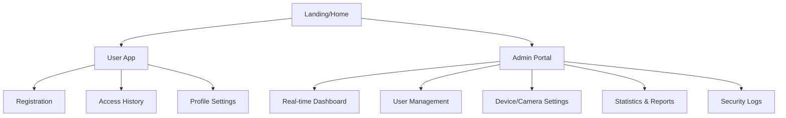

> **작성일**: 2026-06-11
> **버전**: v1.0
> **상태**: 초안
> **요약**: 손바닥 인식 기반 출입 관리 서비스의 UI/UX 컨셉, 정보 구조 및 인터페이스 설계서

---

## 1. 디자인 철학 및 방향성

### 1.1 핵심 가치 (Core Values)
- **Frictionless (무마찰)**: 사용자가 인식 과정을 의식하지 않을 정도로 빠르고 간결한 경험 제공.
- **Trust (신뢰)**: 보안 서비스로서의 안정감과 정확성을 시각적으로 전달.
- **Visibility (가시성)**: 실시간 상태(인식 성공/실패, 출입 현황)를 즉각적으로 파악할 수 있는 고대비 인터페이스.

### 1.2 디자인 테마
- **컨셉**: "Professional Edge"
- **색상 팔레트**: 
  - Primary: `#4fc3f7` (Sky Blue - 신뢰, 기술)
  - Success: `#4caf50` (Green - 승인, 입실)
  - Danger: `#ff5252` (Red - 거부, 퇴실)
  - Background: `#1a1a2e` (Deep Navy - 집중도 향상)
- **타이포그래피**: Pretendard (가독성 높은 산세리프 체)

---

## 2. 사용자 페르소나 및 여정

### 2.1 일반 사용자 (임직원/회원)
- **목표**: 손바닥 등록 후 카드나 지문 없이 편리하게 출입. 자신의 출입 이력 확인.
- **Pain Point**: 등록 과정의 복잡함, 인식 실패 시의 당혹감.

### 2.2 관리자 (시설 관리자)
- **목표**: 실시간 출입 현황 모니터링, 비인가자 탐지, 통계 분석을 통한 인원 관리.
- **Pain Point**: 너무 많은 로그 데이터 사이에서 중요한 이벤트(장애, 무단 침입)를 놓침.

---

## 3. 정보 구조 (Information Architecture)

### 3.1 서비스 맵


---

## 4. 인터페이스 설계 (주요 화면)

### 4.1 일반 사용자용 모바일 웹 (React)
- **손바닥 등록 가이드**: 카메라 가이드를 통해 손바닥 위치를 실시간으로 교정해주는 인터렉티브 인터페이스.
- **출입증(ID) 화면**: 본인의 등록 상태와 최근 출입 기록을 한눈에 보여주는 대시보드형 카드 UI.

### 4.2 관리자 대시보드 (Desktop)
- **Multi-View Monitoring**: 현재 운영 중인 카메라(입실/퇴실) 피드와 인식 결과를 실시간 그리드 배치.
- **Smart Alert System**: 미등록자 감지 시 상단 바에 강렬한 경고 색상으로 알림 스트리밍.
- **Visual Statistics**: Recharts를 활용한 시간대별 출입 인원 추이 및 피크 타임 분석 차트.

---

## 5. 인터페이스 (API/통신) 설계 원칙

### 5.1 RESTful API
- **Endpoint naming**: `/api/v1/{resource}` 형식 준수.
- **Status Codes**: 
  - `200 OK`, `201 Created`
  - `400 Bad Request` (유효하지 않은 손바닥 데이터)
  - `401 Unauthorized` (인증 만료)
  - `403 Forbidden` (접근 권한 없음)

### 5.2 Real-time Interface (WebSocket)
- **채널**: `/ws/events`
- **데이터 포맷**:
  ```json
  {
    "type": "DETECTION_EVENT",
    "payload": {
      "cameraId": "cam_01",
      "status": "SUCCESS",
      "userId": "user_123",
      "timestamp": "2026-06-11T16:00:00Z"
    }
  }
  ```

---

## 6. 컴포넌트 전략 (Design System)

- **Atomic Design 기반**: 
  - Atoms: Buttons, Inputs, Status Badges, Icons.
  - Molecules: Search Bars, Event Rows, Camera Cards.
  - Organisms: Navigation Sidebar, Statistics Grid, Log Table.
- **라이브러리 활용**: 
  - UI: TailwindCSS (커스텀 테마 적용)
  - Icons: Lucide React
  - Charts: Recharts

---

## 7. 향후 확장 계획

- **Multimodal Extension**: 얼굴 인식 병행을 통한 보안 강화 UI 지원.
- **Mobile App (PWA)**: 푸시 알림을 통한 실시간 출입 확인 기능 추가.
- **Internationalization**: 다국어(영어, 일본어 등) 대응을 위한 i18n 구조 설계.